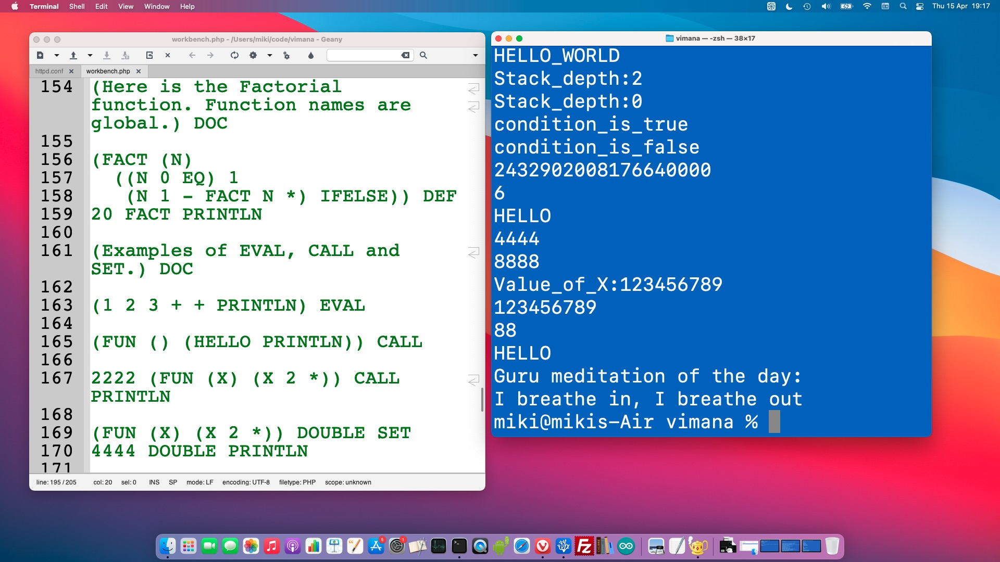

# Vimana

DIY interpreter for a dynamic language influenced by Lisp and Forth.

Current implementation is written in PHP.

See comments and code examples in file [vimana/v1_takeoff/examples.php](vimana/v1_takeoff/examples.php) for how to get started.

Also see header comment in [vimana/v1_takeoff/interpreter.php](vimana/v1_takeoff/interpreter.php).

Run on your local machine in a console window:

    php vimana/v1_takeoff/examples.php

Or go to the directory with the files and run from there:

    cd vimana/v1_takeoff/
    php examples.php

I created Vimana as an experiment, for the fun of it. I am on old Lisp programmer and in school I had a Hewlett & Packard calculator with Reverse Polish Notation. Sweet memories. This is a retro project.

[Watch introduction video](https://youtu.be/BE7UpUuumc4)

License: Creative Commons: Attribution-ShareAlike - CC BY-SA

(I view this as an art project and not a software project, and I enjoy being a rebel, thus my choise of license ;)
